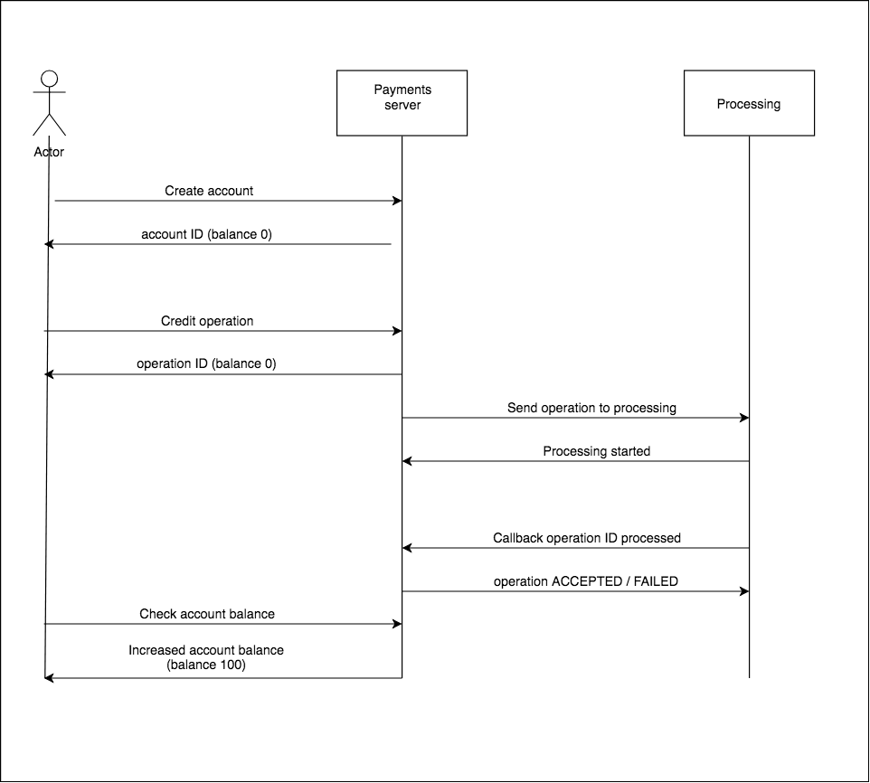

# Тестовое задание "Платежная система"

**Использованные инструменты:**

- Python 3.6
- PostgreSQL 9.6
- aiohttp 3.5.4
- yoyo-migrations 6.1.0
- marshmallow 2.18.1
- asyncpg 0.18.3
- pytest
---
Асинхронный веб-сервис на **aiohttp** выбран для того чтобы держать нагрузку при большом количестве пользователей.

Практически все операции ограничиваются работой с базой (либо внешним API processing системы).

---

**PostgreSQL** выбран, потому что требуется хранить данные в реляционной модели.
Так же реляционная база обеспечивает консинтентность данных через транзакции и блокировки.
 
**yoyo-migrations** - простой механизм для ведения истории миграции БД

**marshmallow**  - для сериализации / десериализации входных, выходных данных.

**asyncpg** - асинхронный коннектор к PostgreSQL

**pytest** - инструмент для тестирования кода

---



## Примеры запросов

Создать аккаунт
```bash
curl -d "first_name=John&last_name=Snow&city=Winterfell&currency=USD" -X POST http://localhost:8080/account/create
```

Проверить баланс пользователя с номером счета 1
```bash
curl http://localhost:8080/account/balance?account_id=1
```

Зачислить 100 единиц валюты счета пользователю с номером счета 1
```bash
curl -d "account_id=1&amount=100" -X POST http://localhost:8080/transfers/credit
```

Перевести 10 единиц валюты счета пользователю с номером счета 1 на счет 2
Если оба пользователя имеют валюту счета USD то перевод будет без конвертации.
Если пользователь 1 имеет валюту EUR а пользователь 2 валюту CAD, то будет конвертация:
10 EUR - > USD -> CAD
```bash
curl -d "sender_id=1&recipient_id=2&amount=10" -X POST http://localhost:8080/transfers/transfer
```

Отправить в процессинг операцию с id 1
```bash
curl -d "operation_id=1" -X POST http://localhost:8080/processing/send
```

Коллбэк на то что операция зачисление денег на счет с id 1 обработана
```bash
curl -d "operation_id=1" -X POST http://localhost:8080/processing/callback/credit
```

Коллбэк на то что операция перевода денег со счета на счет с id 2 обработана
```bash
curl -d "operation_id=2" -X POST http://localhost:8080/processing/callback/transfer
```

Запросить отчет по операциям пользователя John Snow в JSON
```bash
curl http://localhost:8080/report?first_name=John&last_name=Snow
```

Запросить отчет по операциям пользователя John Snow в CSV
```bash
curl http://localhost:8080/report?first_name=John&last_name=Snow&csv=true
```